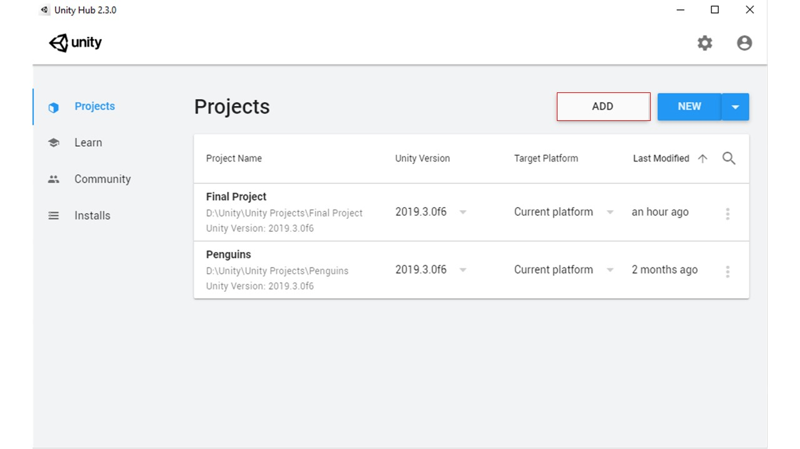
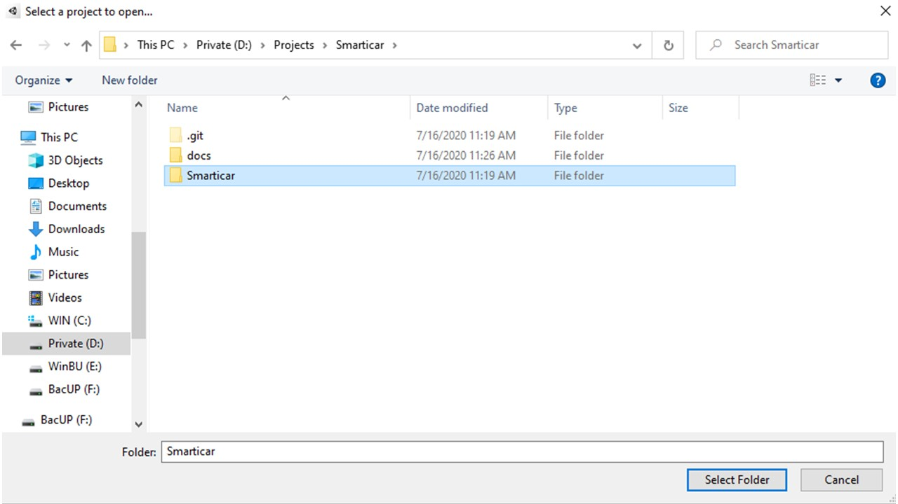

# Smarticar

A self driving car created using Unity ML-Agents.  
Compete against the AI in two different game modes-  

- **Racetrack**, first to complete two consecutive laps
- **Parking**, park as much as you can in different parking spots in one minute

## User Manual

### Edit The Project In Unity

#### Prerequisites

- Unity 2019.3 or higher
- Unity ML-Agents version 0.15.0 (for updating the project into a newer version of Unity ML-Agents follow the `Migrating from earlier versions of ML-Agents` in the `Help` section of the Unity ML-Agents github repository documentation)

1\. Launch Unity Hub.  
2\. Click on the `Add` button.  
3\. Navigate to the Smarticar repository folder and select the `Smarticar` folder.

