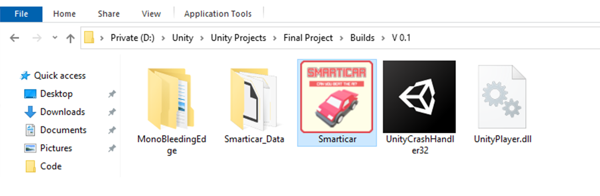
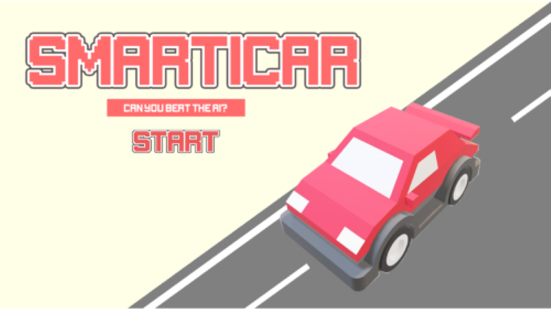

# Smarticar

A self driving car created using [Unity ML-Agents](https://github.com/Unity-Technologies/ml-agents).  
Compete against the AI in two different game modes-  

- **Racetrack**, first to complete two consecutive laps
- **Parking**, park as much as you can in different random parking spots in one minute

for a complete documentation (hebrew), visit [Smarticar.pdf](docs/Smarticar.pdf) in `docs`.  
for the apllication code, visit the [Scripts](Smarticar\Assets\Scripts) folder under `Smarticar\Assets\Scripts`

## General Algorithm

The agents in both game modes were trained using reinforcement learning (an area of machine learning concerned with how software agents ought to take actions in an environment in order to maximize the notion of cumulative reward). Basically, the agents were getting a positive reward when taking correct actions and a negative penalty when taking bad ones while the neural network policy optimized it's mapping from the agent's observations to the decision taking over time.

In the **Racetrack mode**, the agent's observations consisted of 8 raycasts being casted at all directions around the player while the possible actions consisted of turning either left or right.

In the **Parking mode**, the agent's observations consisted of 8 raycasts being casted at all directions around the player, the distance from the player to the chosen parking lot, the direction to the parking lot and the direction the car is currently facing. The agent's possible actions consisted of turning either left, right forward or backwards.

    

## User Manual

### Edit The Project In Unity

#### Prerequisites

- Unity 2019.3 or higher
- Unity ML-Agents version 0.15.0 (for updating the project into a newer version of Unity ML-Agents follow the `Migrating from earlier versions of ML-Agents` in the `Help` section of the Unity ML-Agents github repository documentation)

1\. Launch Unity Hub.  
2\. Click on the `Add` button.  
3\. Navigate to the Smarticar repository folder and select the `Smarticar` folder.

### Playing Instructions

1. Unzip Smarticar.rar. After unzipping the folder, run `Smarticar.exe` in order to start the application

2. Press the START button for starting the game

    

3. Choose the desired game mode 

    

4. After choosing a game mode, the game instructions will appear

    

5. After the countdown, the game will start and will end as soon as one the players wins (first to complete 2 consecutive laps). you can pause the game at any time by pressing on the ESC button

    

6. At the end of the game, stats will be displayed

    

